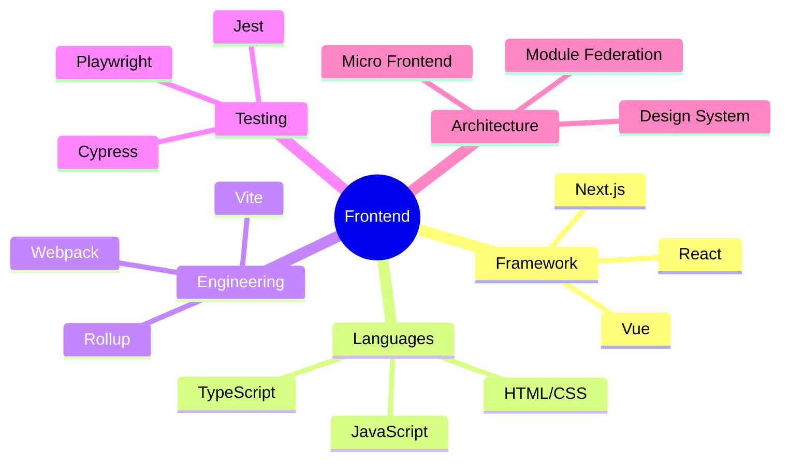

/**
 * @file Profile.ts
 * @description 个人简介
 */

interface Developer {
  name: string;
  title: string;
  location: string;
  languages: string[];
  skills: {
    frontend: string[];
    backend: string[];
    tools: string[];
  };
  contact: {
    email: string;
    website: string;
    linkedin: string;
  };
}

const profile: Developer = {
  name: "[你的名字]",
  title: "Frontend Engineer",
  location: "中国",
  languages: [
    "JavaScript",
    "TypeScript",
    "HTML",
    "CSS"
  ],
  skills: {
    frontend: [
      "React",
      "Vue",
      "Next.js",
      "微前端",
      "性能优化"
    ],
    backend: [
      "Node.js",
      "Express",
      "MongoDB"
    ],
    tools: [
      "Git",
      "Webpack",
      "Docker",
      "CI/CD"
    ]
  },
  contact: {
    email: "your.email@example.com",
    website: "https://your-website.com",
    linkedin: "https://linkedin.com/in/your-profile"
  }
}

console.log("Hello World! 👋")

while (alive) {
  eat();
  sleep();
  code();
  repeat();
}

// 当前状态
$ now-focusing --list
> 专注于前端工程化实践
> 探索 Web 性能优化
> 研究微前端架构

<div align="center">
  
</div>

# Hello World! 

<div align="center">
  
  <br/>
  
  ```typescript
  class Profile {
    private static instance: Profile;
    private constructor() {}
    
    public static getInstance(): Profile {
      if (!Profile.instance) {
        Profile.instance = new Profile();
      }
      return Profile.instance;
    }
    
    public getDetails(): Record<string, any> {
      return {
        name: "[你的名字]",
        title: "Frontend Engineer",
        location: "中国",
        interests: [
          "Web Performance 🚀",
          "Micro Frontends 🔄",
          "Design Systems 🎨",
          "Developer Experience 💡"
        ],
        currentlyLearning: [
          "WebAssembly",
          "Rust",
          "System Design"
        ]
      };
    }
  }
  ```
</div>

<div align="center">
  
  <br/>
  
</div>

<details>
<summary>🎯 技术栈</summary>
<div align="center">



</div>
</details>

<details>
<summary>📊 本周编码时间</summary>
<div align="center">

```text
TypeScript   █████████████░░░░░   64.25 % 
JavaScript   ████░░░░░░░░░░░░░   22.17 % 
Vue          ███░░░░░░░░░░░░░░   13.58 % 
```

</div>
</details>

<details>
<summary>🌟 精选项目</summary>
<div align="center">
  <table>
    <tr>
      <td>
        <a href="项目链接">
          
        </a>
      </td>
      <td>
        <a href="项目链接">
          
        </a>
      </td>
    </tr>
  </table>
</div>
</details>

<div align="center">

### 🎵 正在编码...

[](https://open.spotify.com/user/你的用户名)

---

<a href="https://github.com/你的用户名">
  
</a>
<a href="https://github.com/你的用户名?tab=followers">
  
</a>

</div>
