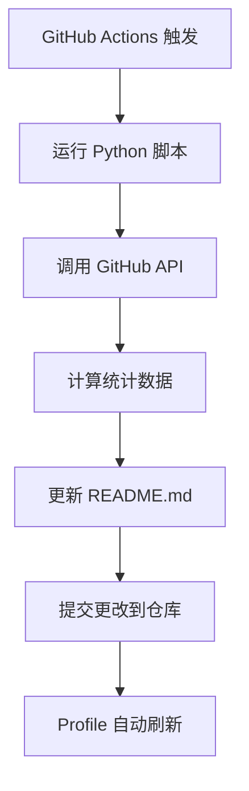

# 🤖 Andrew6rant风格GitHub Profile自动化系统

## 🎯 系统特色

这是一个模仿 [Andrew6rant](https://github.com/Andrew6rant/Andrew6rant) 风格的自动化GitHub Profile系统，具有以下特点：

✅ **数据驱动展示** - 自动计算仓库、提交、星标等统计信息  
✅ **实时自动更新** - 每6小时通过GitHub Actions自动刷新  
✅ **极客技术风格** - 纯代码化，展现编程实力  
✅ **零维护成本** - 一次设置，永久自动运行  

## 📋 快速开始

### 1. 创建仓库
```bash
# 在GitHub上创建与用户名相同的仓库
# 例如：用户名为 zjd，则创建 zjd/zjd 仓库
```

### 2. 上传文件
将以下文件上传到你的仓库：
```
├── README.md                 # 主profile文件
├── generate_stats.py         # Python统计生成脚本
├── requirements.txt          # Python依赖
├── snake-workflow.yml        # GitHub Actions配置
└── cache/                    # 统计数据缓存目录
    └── .gitkeep
```

### 3. 设置GitHub Actions
1. 将 `snake-workflow.yml` 移动到 `.github/workflows/` 目录
2. 确保仓库有Actions权限
3. 系统将自动开始运行

### 4. 个性化配置
修改 `README.md` 中的个人信息：
- 社交链接（LinkedIn, Twitter等）
- 个人邮箱
- 项目展示链接

## 🔧 系统工作原理

### 自动化流程


### 统计数据包含
- 📊 总仓库数量
- 💻 总提交次数
- ⭐ 总获得星标
- 🍴 总被fork次数
- 📝 Issues和PRs数量
- 📈 代码行数估算
- 🏷️ 主要编程语言

### 更新频率
- **自动更新**: 每6小时
- **手动触发**: 在Actions页面可以手动运行
- **推送触发**: 每次push到main分支时

## ⚙️ 高级定制

### 修改更新频率
编辑 `snake-workflow.yml` 中的 cron 表达式：
```yaml
schedule:
  - cron: "0 */6 * * *"  # 每6小时
  - cron: "0 0 * * *"    # 每天一次
  - cron: "0 */12 * * *" # 每12小时
```

### 自定义统计显示
修改 `generate_stats.py` 中的统计逻辑：
- 调整代码行数估算算法
- 修改语言统计权重
- 添加新的统计维度

### 主题颜色调整
在 `README.md` 中修改GitHub Stats的主题：
```markdown
theme=dark          # 深色主题
theme=radical       # 激进主题  
theme=merko         # 绿色主题
theme=gruvbox       # 复古主题
```

## 🚨 注意事项

### API限制
- 公开API：每小时60次请求
- 认证API：每小时5000次请求
- 建议设置GITHUB_TOKEN以避免限制

### 权限设置
确保仓库Actions有写入权限：
1. Settings → Actions → General
2. Workflow permissions → Read and write permissions
3. ✅ Allow GitHub Actions to create and approve pull requests

### 故障排除
- **Actions失败**: 检查Python依赖和API权限
- **统计不准确**: GitHub API数据有延迟，属正常现象
- **更新不及时**: 检查cron时间设置和时区

## 📚 技术栈

- **Python 3.9+** - 数据处理和API调用
- **GitHub Actions** - 自动化执行
- **GitHub API v3** - 数据获取
- **Markdown** - Profile展示

## 🎯 效果预览

这个系统将为你创建一个类似Andrew6rant的profile：
- 📊 实时GitHub统计面板
- 🤖 自动化更新标识
- 💻 技术导向的简洁设计
- 🔥 极客风格的数据展示

---

## 🔗 参考资源

- [Andrew6rant原版](https://github.com/Andrew6rant/Andrew6rant) - 原始灵感来源
- [GitHub API文档](https://docs.github.com/en/rest) - API使用指南
- [GitHub Actions文档](https://docs.github.com/en/actions) - 自动化配置

**🎉 享受你的自动化GitHub Profile吧！一次设置，终身受益！** 